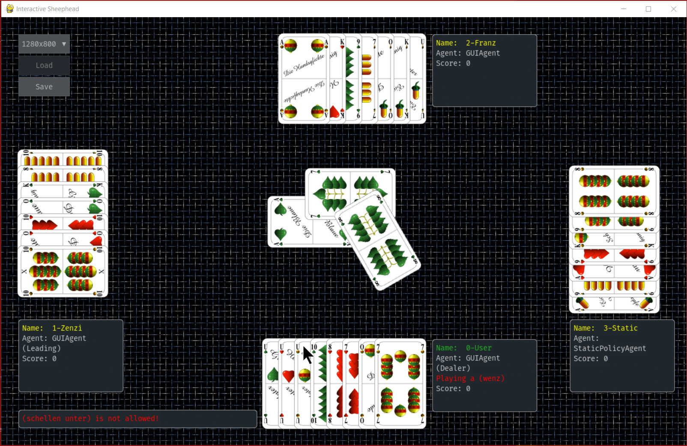

# Forked AlphaSheep - Reinforcement Learning for Schafkopf

Please see https://github.com/ttbrunner/alphasheep for project infos of AlphaSheep - Reinforcement Learning for Schafkopf

#### GUI
- Basic PyGame implementation wih pygame_ui

Foremost, it is about machine learning not about more fancy GUIs with Cards.js or Unity. But I've modified gui.py ... to allow for more options to select a card and to allow multiple GUI agents in a game, when invoked by e.g. "python play_with_gui.py --p0-agent=user --p1-agent=user --p2-agent=user --p3-agent=user" 
With the parameter --card-deck hands defined in a YAML file could be dealt when starting "python play_with_gui.py --card-deck data/states/gui_deck.yaml ..." 
Besides point and click, the cards of GUI agents may now be played by point and key. The spacebar will allow the playout of a card of a GUI agent when pressed while hovering over a card in a hand. Anyways, the spacebar will also move the gameplay forward and allow the playout of cards of static agents.  
Alternatively, you may also enter the number keys 1-8 to play out the n-th card in the hand of a GUI player.
Or enter a card code i.e 'es' for the oide Eichel S.., 'gz' for the Blauen Eisenbahner, 's7' for the Schellen Belli, 'hk' for the king of hearts etc. 
The positions of the cards in the trick will vary to make GUI play more pleasing.

#### Agents
-  ...

#### Notes
Rufspiel and Ramsch and other solos like Bettel, Geier, Kaiser and their Farbspiel variants etc. could be added ...
Add the bidding phase etc.

Further agents for other card games might be trained: Cego for Schwarzwalders, Doppelkopf for the Oldenburger Land, Skat for Altenburg, Zwickern for Flensburg. Königrufen, Zwanzigerrufen, Neunzehnerrufen and Schnapsen might be added for the Austrian Kaiserlanden.

